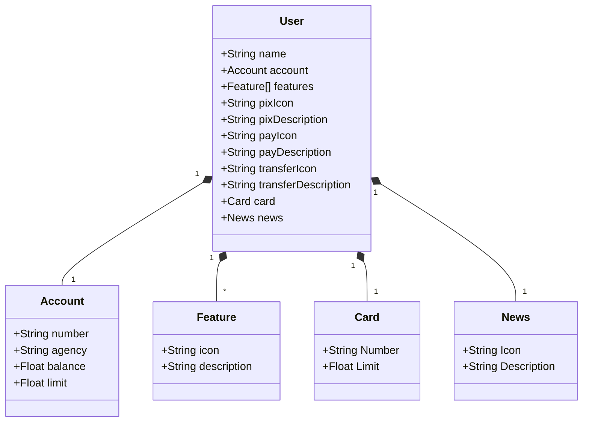

API - REST

## Diagrama de classes

```mermaid

classDiagram
    class User {
        +String name
        +Account account
        +Feature[] features
        +String pixIcon
        +String pixDescription
        +String payIcon
        +String payDescription
        +String transferIcon
        +String transferDescription
        +Card card
        +News news
    }

    class Account {
        +String number
        +String agency
        +Float balance
        +Float limit
    }

    class Feature {
        +String icon
        +String description
    }

    class Card {
        +String Number
        +Float Limit
    }

    class News {
        +String Icon
        +String Description
    }

    User "1" *-- "1" Account
    User "1" *-- "*" Feature
    User "1" *-- "1" Card
    User "1" *-- "1" News
```
